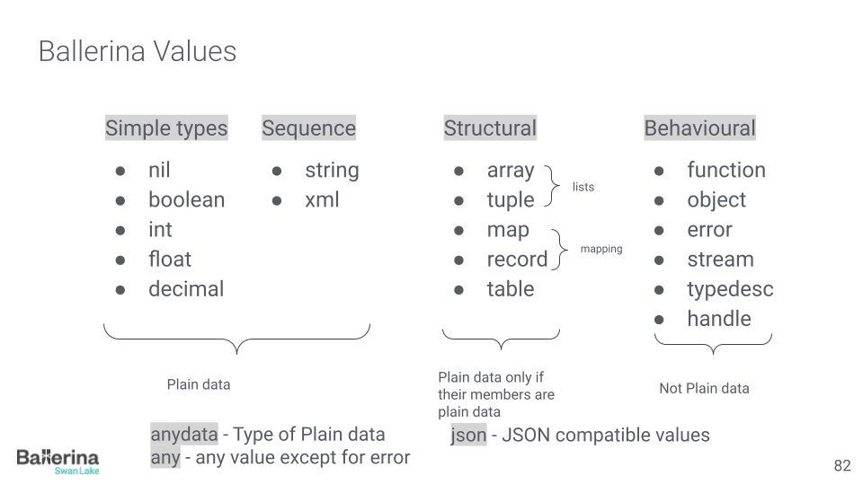

# Ballerina Data Values

This sessions is dedicated to exploring the plain data. Each provided example demonstrates the fundamental data types and structures in Ballerina, showcasing why it is an effective language for handling data as data.

## Contents

Each file in this repository corresponds to a specific aspect of Ballerina's data handling capabilities. Below are brief descriptions of what each file covers:

### Boolean
- **01_boolean.bal**
  - About good old boolean values.

### Numeric Types
- **02_int.bal**
  - Usage of integers.
- **04_float.bal**
  - Handling floating-point numbers.
- **05_decimal.bal**
  - Working with decimal numbers.
- **06_numeric_types.bal**
  - Overview of all numeric types in Ballerina.

### Strings and Collections
- **07_strings.bal**
  - String manipulation and functions.
- **08_arrays.bal**
  - Array operations and examples.
- **09_tuples.bal**
  - Using tuples for grouping different types.
- **10_maps.bal**
  - Map collections and operations.
- **11_records.bal**
  - Introduction to records.
- **12_closed_records.bal**
  - Exploring closed records.
- **13_tables.bal**
  - Working with tabular data.

### Advanced Data Structures
- **14_unions.bal**
  - Utilizing union types for flexible data structures.
- **15_immutable_values.bal**
  - Exploring immutability in Ballerina.

### Specialized Data Types
- **16_json.bal**
  - JSON manipulation and parsing.
- **17_xml.bal**
  - Handling XML data.

### Error Handling
- **18_errors.bal**
  - A quick introduction to error values.
